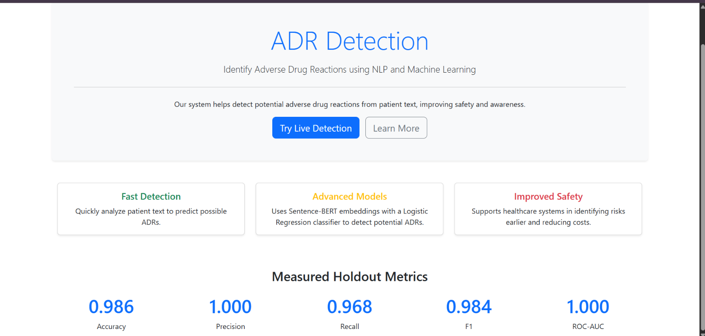
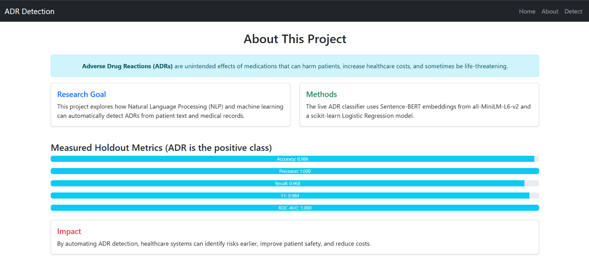
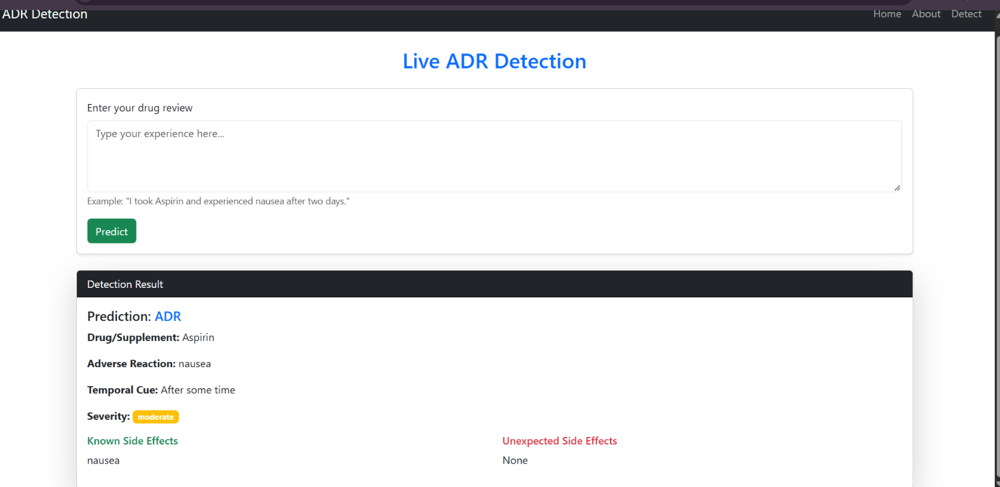
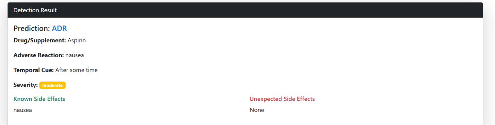

START COPYING HERE

# ADR Detection Web App

An NLP and machine-learning based web application for detecting potential Adverse Drug Reactions (ADRs) from patient reviews.

The application analyzes patient text, identifies the mentioned drug and possible adverse reactions, categorizes severity, and compares detected reactions with known side effects.

> Disclaimer: This project is an educational/research prototype and is not intended for clinical diagnosis or medical decision-making.

## Features

- ADR / Non-ADR text classification
- Drug name extraction
- Adverse reaction extraction
- Severity categorization
- Temporal cue detection
- Comparison with known and unexpected side effects
- MongoDB storage for submitted reviews
- Interactive web interface
- Home, About, and Live Detection pages
- Local and cloud deployment support

## How It Works

Patient Review
↓
Text Processing
↓
ADR Classification
↓
Information Extraction
↓
Drug + Reaction + Temporal Cue
↓
Severity Categorization
↓
Known / Unexpected Side Effects
↓
MongoDB Storage
↓
Detection Result

## Example

Input:

I took Aspirin and experienced nausea after two days.

Output:

Prediction: ADR
Drug: Aspirin
Adverse Reaction: nausea
Temporal Cue: After some time
Severity: moderate
Known Side Effects: nausea
Unexpected Side Effects: None

## Technology Stack

### Programming Language
- Python

### Backend
- Flask
- Gunicorn

### Machine Learning / NLP
- Sentence-BERT (`sentence-transformers/all-MiniLM-L6-v2`) generates embeddings from patient review text
- Scikit-learn
- Joblib
- Logistic Regression trained on the Sentence-BERT embeddings to predict ADR vs NON-ADR
- Drug extraction, adverse reaction extraction, temporal cue detection, and severity categorization
- Comparison of detected reactions with known and unexpected side effects

### Database
- MongoDB Atlas
- PyMongo for storing reviews

### Frontend
- HTML
- CSS
- JavaScript
- Flask Templates

### Holdout Evaluation Metrics

These are holdout evaluation metrics from this project's dataset, not medical or
clinical accuracy. The evaluation used 232 reviews, with 70 reviews in the held-out
test set.

| Metric | Result |
| --- | ---: |
| Accuracy | 98.57% |
| Precision | 100.00% |
| Recall | 96.77% |
| F1 Score | 98.36% |
| ROC-AUC | 100.00% |

### Deployment
- Render

## Project Structure

ADR-Detection/
├── app.py
├── nlp_pipeline.py
├── requirements.txt
├── Procfile
├── .python-version
├── .gitignore
├── adr_sbert_classifier.pkl
├── model_metrics.json
├── adr_dataset.csv
├── adr_dataset_combined.csv
├── synthetic_dataset.csv
├── annotate.py
├── generate_dataset.py
├── merge_dataset.py
├── export.py
├── scraper.py
├── docs/
│   └── screenshots/
│       ├── home.png
│       ├── about.png
│       ├── detection.png
│       └── result.png
└── templates/
    ├── base.html
    ├── home.html
    ├── about.html
    ├── detect.html
    └── index.html

## Running Locally

### 1. Clone the repository

git clone https://github.com/2410030044-gif/ADR-Detection.git

cd ADR-Detection

### 2. Install dependencies

pip install -r requirements.txt

### 3. Configure MongoDB

Create a .env file in the project root:

MONGO_URI=your_mongodb_connection_string

The .env file should never be committed to GitHub.

### 4. Train the Sentence-BERT classifier

The training script uses a stratified 70/30 train/holdout split from
`adr_dataset_combined.csv`. It saves the Logistic Regression classifier to
`adr_sbert_classifier.pkl` and the measured holdout metrics to
`model_metrics.json`. The Sentence-BERT encoder is downloaded from Hugging Face
when it is first needed; it is not saved as a pickle.

```bash
python nlp_pipeline.py
```

The dataset includes synthetic examples.

### 5. Run the application

```bash
python app.py
```

Open the application in your browser:

http://127.0.0.1:5000

## Main Application Pages

### Home

Provides an overview of the ADR Detection system, its purpose, and key research highlights.

### About

Describes the research goal, Sentence-BERT + Logistic Regression methodology, measured holdout metrics, and potential impact of automated ADR detection.

### Live Detection

Allows users to enter a patient/drug review and receive:

- ADR prediction
- Drug name
- Adverse reaction
- Temporal cue
- Severity
- Known side effects
- Unexpected side effects

## Project Screenshots

### 1. Home Page



### 2. About / Model Performance



### 3. Live ADR Detection



### 4. Detection Result



## My Contribution

This was developed as a group project.

My individual contribution included:

- Full-stack implementation of the application
- Flask backend development
- NLP/ML integration
- ADR classification integration
- Drug and reaction information extraction
- Severity categorization logic
- MongoDB database integration
- Web interface implementation
- UI/UX improvements
- Local deployment and debugging

## Project Highlights

The application demonstrates the integration of:

Machine Learning + Natural Language Processing + Web Development + Database Integration + Cloud Deployment

The system provides an end-to-end workflow from patient text input to ML/NLP analysis, structured ADR information, database storage, and web-based results.

## Future Improvements

- Improve NLP-based drug and adverse reaction extraction
- Add prediction confidence scores
- Expand the drug and side-effect knowledge base
- Improve severity classification using trained models
- Support a larger and more diverse dataset
- Add user authentication
- Add ADR history and analytics dashboards
- Improve model evaluation with larger datasets
- Add more advanced NLP models for contextual understanding

## Disclaimer

This application is intended for educational and research purposes only.

It should not be used as a substitute for professional medical advice, diagnosis, or treatment.

END COPYING HERE